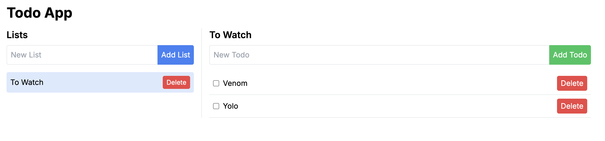

# Todo App

Simple Todo app using NextJS , MySQL , Prisma for learning prupose.

Please check git branches.

Git branches are

## Step 1



Simple List and Todo.

## Step 2

Finish product but code are not refactor yet

## Step 3

Refactor the code and using hooks. Fixed bugs. Folder structure need to refactor.


## Before Running

For generate the prisma class, create .env file and add following data.

**.env**

```
DATABASE_URL="mysql://root:@localhost:3306/todoapp"
JWT_SECRET="mysecretkey"
JWT_REFRESH_SECRET="myrefreshsecretkey"
```

**to update the mysql data schema**

```
 npx prisma generate
 npx prisma migrate dev --name init
 ```